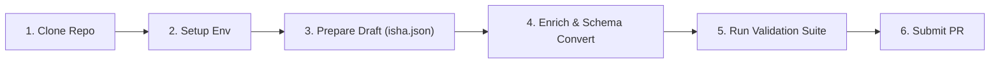

# all-religious-texts

[](LICENSE)
[](DATA_LICENSE.md)
[](.github/workflows/validate.yml)
[](https://www.crine.in)

> **The world's largest open-source collection of religious texts.**
>
> Developed and maintained by [**CRINE**](https://www.crine.in) ([github.com/crine-in](https://github.com/crine-in)).

---

## Overview

**`all-religious-texts`** is the canonical specification, standards hub, schema repository, and architectural foundation for the entire **All Religious Texts (ART)** open digital archive ecosystem.

Think of this repository as:
* **Project Gutenberg** for sacred scriptures
* **Common Crawl** for digital humanities & theology
* **Unicode Consortium** for canonical verse structures
* **Linux Foundation** quality and governance standards
* **MDN Web Docs** level developer experience

This repository establishes the machine-readable standard for storing, validating, searching, referencing, and translating sacred literature across all human religious traditions.

> [!IMPORTANT]
> **Ecosystem Specification Notice**:
> This repository (`all-religious-texts`) serves as the central standards specification and tooling registry. Actual corpus texts reside in dedicated ecosystem repositories (e.g., [`art-hinduism`](https://github.com/crine-in/art-hinduism), [`art-buddhism`](https://github.com/crine-in/art-buddhism), [`art-christianity`](https://github.com/crine-in/art-christianity), [`art-islam`](https://github.com/crine-in/art-islam), [`art-judaism`](https://github.com/crine-in/art-judaism), etc.).

---

## Developer Flow: Clone to Contribution

This guide outlines the end-to-end contribution workflow using reference templates [`isha.json`](/isha.json) and [`katha.json`](/katha.json).



### Step 1: Clone the Repository
```bash
git clone https://github.com/crine-in/all-religious-texts.git
cd all-religious-texts
```

### Step 2: Environment Setup
```bash
python3 -m venv venv
source venv/bin/activate
pip install -r requirements.txt
```

### Step 3: Reference Dataset Inspection
Use reference draft datasets provided in root:
* [`isha.json`](/isha.json) — Isha Upanishad draft dataset (18 mantras)
* [`katha.json`](/katha.json) — Katha Upanishad draft dataset (119 mantras)

Draft datasets contain raw fields (`chapter_number`, `verse`, `text`).

### Step 4: Schema Enrichment & Conversion
Enrich raw reference datasets into canonical `schemas/verse.schema.json` format:

```bash
# Enrich Isha Upanishad reference file
python3 tools/enrich_dataset.py \
  --input isha.json \
  --output examples/isha_enriched.json \
  --book "Isha Upanishad" \
  --collection "Principal Upanishads" \
  --religion "Hinduism"

# Enrich Katha Upanishad reference file
python3 tools/enrich_dataset.py \
  --input katha.json \
  --output examples/katha_enriched.json \
  --book "Katha Upanishad" \
  --collection "Principal Upanishads" \
  --religion "Hinduism"
```

### Step 5: Run Full Validation Suite
Ensure all JSON syntax, schemas, master IDs, UTF-8 encodings, and pytest suites pass cleanly:

```bash
python3 validators/run_all.py
pytest tests/
```

### Step 6: Create Branch & Submit Pull Request
```bash
git checkout -b feat/add-enriched-upanishads
git add .
git commit -m "feat(dataset): enrich reference isha.json and katha.json to universal verse schema"
git push origin feat/add-enriched-upanishads
```

---

## Universal Data Hierarchy & Verse Schema

### Data Hierarchy

$$\text{Religion} \longrightarrow \text{Collection} \longrightarrow \text{Book} \longrightarrow \text{Language} \longrightarrow \text{Script} \longrightarrow \text{Edition} \longrightarrow \text{Verse Data}$$

### Universal Verse Schema Example

```json
{
  "$schema": "https://raw.githubusercontent.com/crine-in/all-religious-texts/main/schemas/verse.schema.json",
  "id": "hinduism:principal-upanishads:isha-upanishad:1.1",
  "externalId": 1,
  "religion": "Hinduism",
  "collection": "Principal Upanishads",
  "book": "Isha Upanishad",
  "chapter": 1,
  "verse": 1,
  "citation": "1.1",
  "language": "Sanskrit",
  "script": "IAST",
  "text": "īśā vāsyam idaṃ sarvaṃ yat kiñca jagatyāṃ jagat |\ntena tyaktena bhuñjīthā mā gṛdhaḥ kasya sviddhanam",
  "license": "Public Domain",
  "source": "Reference file: isha.json",
  "checksum": "8b08216b2ef83b544d6db8f95c117b43a9b1c784f1fa7f1f0a20ef1e7654a93f"
}
```

---

## Repository Architecture

```text
all-religious-texts/
├── README.md                 # Primary ecosystem documentation & guide
├── LICENSE                   # MIT License for repository infrastructure
├── DATA_LICENSE.md           # Licensing policies (CC BY 4.0 for metadata, original for texts)
├── ATTRIBUTION.md            # Provenance, credit standards, and source tracking
├── CONTRIBUTING.md           # Contribution workflow & guidelines
├── CODE_OF_CONDUCT.md        # Community code of conduct
├── SECURITY.md               # Vulnerability reporting & dataset integrity
├── ROADMAP.md                # 20+ year architectural expansion roadmap
├── CHANGELOG.md              # Versioning & schema modification history
├── SCHEMA.md                 # Universal Schema specification summary
├── isha.json                 # Reference draft dataset (Isha Upanishad)
├── katha.json                # Reference draft dataset (Katha Upanishad)
├── pyproject.toml            # Python packaging & validation configuration
├── requirements.txt          # Python dependencies for validators & tools
├── .github/                  # CI/CD workflows, issue templates, PR templates
├── schemas/                  # Draft 2020-12 JSON Schemas for verses, books, metadata
├── metadata/                 # Master registries (religions, collections, languages, scripts)
├── validators/               # Python CLI validation suite (schema, UTF-8, IDs, filenames)
├── tools/                    # Ingestion & enrichment utilities (enrich_dataset.py, txt_to_json.py)
├── scripts/                  # Formatting, checksums, verse renumbering, link checking
├── docs/                     # Developer docs, architecture guides, data standards
├── api/                      # OpenAPI 3.0 specification for future REST/GraphQL APIs
├── packages/                 # SDK specifications and package stubs (JS, Py, Go, Rust, Flutter)
├── tests/                    # Automated unit tests for validation & ingestion tooling
└── examples/                 # Sample code & data snippets for developers and AI integrators
```

---

## Supported Religious Traditions

The ART ecosystem architecture supports 20+ major traditions out-of-the-box:

* **Hinduism** (`art-hinduism`)
* **Buddhism** (`art-buddhism`)
* **Jainism** (`art-jainism`)
* **Sikhism** (`art-sikhism`)
* **Christianity** (`art-christianity`)
* **Islam** (`art-islam`)
* **Judaism** (`art-judaism`)
* **Zoroastrianism** (`art-zoroastrianism`)
* **Baháʼí Faith** (`art-bahai`)
* **Taoism** (`art-taoism`)
* **Confucianism** (`art-confucianism`)
* **Shinto** (`art-shinto`)
* **Ancient Egyptian Religion** (`art-egyptian`)
* **Greek Religion** (`art-greek`)
* **Roman Religion** (`art-roman`)
* **Norse Religion** (`art-norse`)
* **Chinese Folk Religion** (`art-chinese-folk`)
* **African Traditional Religions** (`art-african`)
* **Indigenous Traditions** (`art-indigenous`)
* **Other Traditions** (`art-other`)

---

## Technical Tooling

* **`tools/enrich_dataset.py`**: Convert draft datasets like `isha.json` and `katha.json` to canonical verse schema.
* **`tools/txt_to_json.py`**: Parse formatted plain text scriptures into JSON schema.
* **`tools/xml_to_json.py`**: Ingest XML & TEI P5 digital humanities markups.
* **`tools/md_to_json.py`**: Convert Markdown verse listings.
* **`tools/csv_to_json.py`**: Import tabular verse datasets.
* **`scripts/generate_checksums.py`**: Generate SHA-256 integrity checksums.
* **`scripts/renumber_verses.py`**: Fix verse numbering gaps and citations.
* **`validators/run_all.py`**: Comprehensive validation CLI.

---

## Organization & Contact

* **Organization**: CRINE
* **GitHub**: [github.com/crine-in](https://github.com/crine-in)
* **Website**: [www.crine.in](https://www.crine.in)
